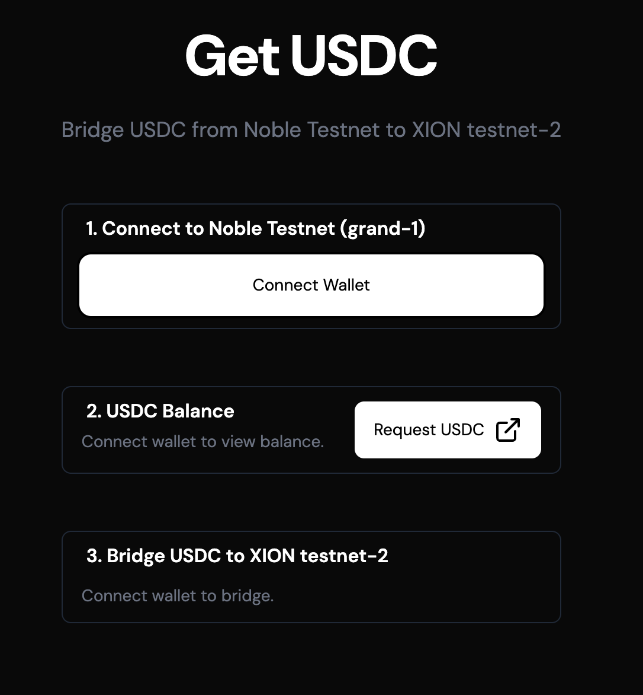

# XION Testnet Bridge USDC From Noble

Welcome! This is a simple and user-friendly interface that allows you to bridge USDC tokens from Noble testnet (grand-1) to XION testnet (xion-testnet-2).

## Getting Started

To use this bridge, you'll need:
- A Cosmos-compatible wallet extension (like Keplr)
- Some USDC tokens on Noble testnet (link to request is on app)

## What is this?

This bridge helps you transfer your USDC tokens between two testnet environments:
- **Source**: Noble testnet (grand-1)
- **Destination**: XION testnet (xion-testnet-2)

This is particularly useful for developers and users who want to test applications on the XION testnet using USDC tokens.